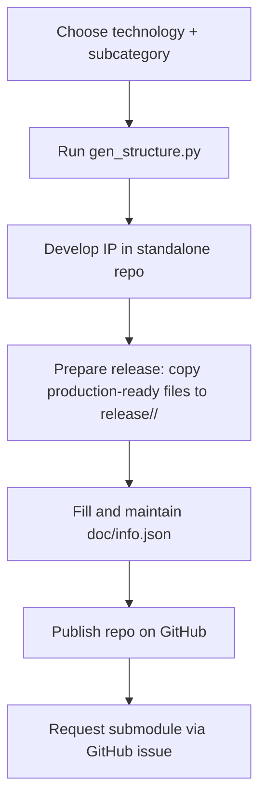

# IP Repository Structure

## Key assumptions

The organization of this repository and its tooling is guided by the following
assumptions, which define both scope and integration boundaries:

1) The primary focus of this repository is the IP data itself rather than the hosting of
   implementation flows.
2) IP data is intentionally decoupled from flows. Flows are expected to be delivered as
   separate repositories and to source and export IP data using the proposed format.
3) Dependencies are handled recursively and may be implemented as submodules to preserve
   traceability and ensure reproducible integration.

## IP development and contribution workflow

This repository is not intended for active IP development. Instead, use the generator
script to create a standalone IP repository, publish it on GitHub, and then request
inclusion as a submodule in the corresponding Open-Silicon-MPW repository. The goal is
to keep this repository as a curated aggregation of production-ready IPs and shared
automation assets.



Keep `doc/info.json` accurate throughout development. This metadata is used for IP
evaluation, maintenance, and provisioning, and it enables automated checks. Many of
these checks are expected to be handled by GitHub Actions (data consistency, DRC, LVS,
and linting), so completeness and correctness are mandatory.

## Generating a new IP structure - automated

Use the `gen_structure.py` script outside this repository to initialize a new IP repo.
The script performs the following actions to standardize layout and metadata:

- Assign a 4-digit ID and create the top-level directory name.
- Create the standard recursive directory structure.
- Write `doc/info.json` with name, type, technology, and metadata fields.
- Pull the appropriate TRL template into `doc/`.

Usage (run from a local working directory outside this repository):

```
python3 gen_structure.py <technology> <subcategory> [dependency1 dependency2 ...]
```

`technology` must be `IHP`.

Before choosing a subcategory, review `IP-Categories.md` to select the appropriate
category and abbreviation and to ensure consistency with the published taxonomy.

Warning: Only subcategories defined in `ip-categories.json` are permitted. Refer to
`IP-Categories.md` for the allowed list.

## Naming convention - automated

The top-level directory name must follow the format below.

Format:

```
<TECH>__<subcategory-abbrev>-<4digits>
```

Components:

- `TECH`: process provider family identifier, currently `IHP`
- `subcategory-abbrev`: abbreviation from `ip-categories.json`
- `4digits`: randomly generated 4-digit decimal identifier

The IP type is derived from the chosen subcategory when running the generator. There is
no explicit type token in the directory name, which keeps the naming scheme compact
while preserving the category semantics via the subcategory.

Examples:

```
IHP__PLL-3840
```

## Recursive structure

The generated IP includes a complete design structure at the top level and the same
structure recursively for every dependency listed in the generation script arguments.
Each dependency is created under `dependencies/`, which is also where you should place
dependency IPs. Those dependency IPs can be submodules and should follow the same
structure (`doc/`, `release/`, and design folders) as the top-level IP so that tooling
and automated checks can treat them uniformly.

## Release data placement

The `release/` directory must contain production-ready files that enable automated DRC
and LVS checks. Filenames and their corresponding locations under `release/<version>/`
must be annotated in `doc/info.json` so automation can locate and validate them. Release
data should include the finalized deliverables required to execute sign-off checks (for
example, GDS and netlist artifacts), and the annotations in `doc/info.json` must point to
the exact files used by the automated flows.

## Adding your IP to Open-Silicon-MPW

To request inclusion in Open-Silicon-MPW, follow the steps below. These steps ensure
your repository is correctly prepared for submodule integration.

1) Run the script locally, outside this repository, to generate the IP directory.
2) Create a GitHub repository using the generated directory name.
3) Initialize and push your IP repository; it can then be added here as a submodule.

```
git init
git add .
git commit -s -m "Initial commit"
git branch -M main
git remote add origin https://github.com/<org>/<repo>.git
git push -u origin main
```

4) Open a GitHub issue requesting the Open-Silicon-MPW team to add your repository as a
   submodule.

Issue template (include the .gitmodules snippet so it can be copied directly into the
main repository):

```
## Submodule request

- Repository URL: https://github.com/<org>/<repo>.git
- Category directory: March-2026/<Category> (Analog, Digital, RF, Mixed-Signal)
- Submodule path: March-2026/<Category>/<TECH>__<subcategory-abbrev>-<4digits>

### .gitmodules snippet

[submodule "March-2026/<Category>/<TECH>__<subcategory-abbrev>-<4digits>"]
  path = March-2026/<Category>/<TECH>__<subcategory-abbrev>-<4digits>
  url = https://github.com/<org>/<repo>.git
```

## Guidelines for Flow Developers

Flow automation should preserve the systematic repository structure created by the
generator and used across IPs. The `doc/info.json` file is required metadata and should
be filled out automatically by the flow. This automation is work in progress, so treat
missing fields as a blocking issue and plan for incremental updates as the flow evolves.
