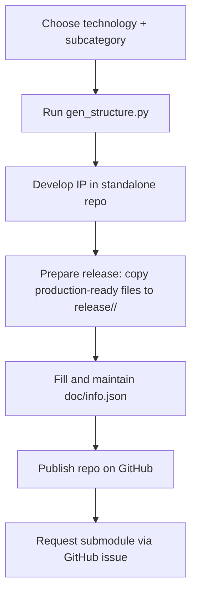

# IP Repository Structure

## IP development and contribution workflow

Do not develop the IP directly in this repository. Use the generator script to create a
standalone IP repository, then publish it on GitHub and request inclusion as a submodule
in the corresponding Open-Silicon-MPW repository.



Keep `doc/info.json` accurate throughout development. The metadata is used for IP
evaluation, maintenance, and provisioning, and it enables automated checks.
Many of these checks will be handled by GitHub Actions (data consistency, DRC, LVS, linter).


## Generating a new IP structure

Use the `gen_structure.py` script outside this repository to initialize a new IP repo.
The script will:

- Assign a 4-digit ID and create the top-level directory name.
- Create the standard recursive directory structure.
- Write `doc/info.json` with name, type, technology, and metadata fields.
- Pull the appropriate TRL template into `doc/`.

Usage:

```
python3 gen_structure.py <technology> <subcategory> [dependency1 dependency2 ...]
```

`technology` must be one of: `SKY`, `IHP`, `GF`.

Before choosing a subcategory, review `IP-Categories.md` to select an appropriate category.

Warning: Only subcategories defined in `ip-categories.json` are permitted.
See `IP-Categories.md` for the allowed list.

## Naming convention

Format:

```
<TECH>__<subcategory-abbrev>-<4digits>
```

Components:

- `TECH`: process provider family identifier, e.g. `SKY`, `GF`, `IHP`, `ICS`
- `subcategory-abbrev`: abbreviation from `ip-categories.json`
- `4digits`: randomly generated 4-digit decimal identifier

The IP type is derived from the chosen subcategory when running the generator.

Examples:

```
SKY__ADC-0421
IHP__PLL-3840
GF__MCU-1207
```
## Recursive structure

The generated IP has a full design structure at the top level and the same structure
recursively for every dependency listed in the generation script arguments. Each
dependency is created under `dependencies/`, which is also where you should place
dependency IPs. Those dependency IPs can be submodules and should follow the same
structure (`doc/`, `release/`, and design folders) as the top-level IP.

## Adding your IP to Open-Silicon-MPW

1) Run the script locally, outside this repository, to generate the IP directory.
2) Create a GitHub repository using the generated directory name.
3) Initialize and push your IP repository, then your repository can be added here
   as a submodule.

```
git init
git add .
git commit -s -m "Initial commit"
git branch -M main
git remote add origin https://github.com/<org>/<repo>.git
git push -u origin main
```
4) Open a GitHub issue requesting the Open-Silicon-MPW team to add your repository as a submodule.

Issue template (include the .gitmodules snippet):

```
## Submodule request

- Repository URL: https://github.com/<org>/<repo>.git
- Category directory: <Category> (Analog, Digital, RF, Mixed-Signal)
- Submodule path: <Category>/<TECH>__<subcategory-abbrev>-<4digits>

### .gitmodules snippet

[submodule "<Category>/<TECH>__<subcategory-abbrev>-<4digits>"]
  path = <Category>/<TECH>__<subcategory-abbrev>-<4digits>
  url = https://github.com/<org>/<repo>.git
```
