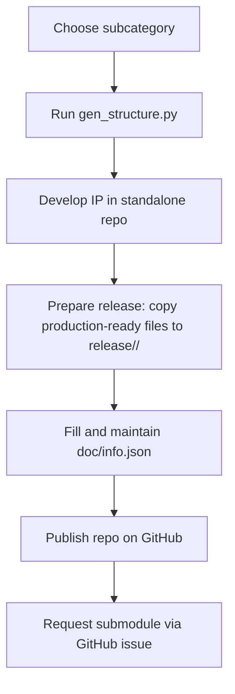

# IP Repository Structure

## IP development and contribution workflow

Do not develop the IP directly in this repository. Use the generator script to create a
standalone IP repository, then publish it on GitHub and request inclusion as a submodule.



Keep `doc/info.json` accurate throughout development. The metadata is used for IP
evaluation, maintenance, and provisioning, and it enables automated checks.
Many of these checks will be handled by GitHub Actions (data consistency, DRC, LVS, linter).

## Naming convention

Format:

```
<TECH>_<TYPE>__<subcategory-abbrev>-<4digits>
```

Components:

- `TECH`: process provider family identifier, e.g. `SKY`, `GF`, `IHP`, `ICS`
- `TYPE`: IP domain letter: `A` (Analog), `D` (Digital), `P` (Photonics), `M` (Mixed-signal), `R` (RF/mmWave)
- `subcategory-abbrev`: abbreviation from `ip-categories.json`
- `4digits`: randomly generated 4-digit decimal identifier

Examples:

```
SKY_M__ADC-0421
IHP_M__PLL-3840
GF_D__MCU-1207
```

## Generating a new IP structure

Use the `gen_structure.py` script outside this repository to initialize a new IP repo.
The script will:

- Assign a 4-digit ID and create the top-level directory name.
- Create the standard recursive directory structure.
- Write `doc/info.json` with name, type, technology, and metadata fields.
- Pull the appropriate TRL template into `doc/`.

Usage:

```
python3 gen_structure.py <subcategory> [dependency1 dependency2 ...]
```

Warning: Only subcategories defined in `IP/ip-categories.json` are permitted.
See `IP/IP-Categories.md` for the allowed list.

## Recursive structure

The generated IP has a full design structure at the top level and the same structure
recursively for every dependency listed in the arguments. Each dependency becomes a
subdirectory under `dependencies/` and includes its own `doc/`, `release/`, and design
folders, mirroring the top-level layout.

## Adding your IP to EuroCDP

1) Run the script locally, outside this repository, to generate the IP directory.
2) Create a GitHub repository using the generated directory name.
3) Initialize and push your IP repository, then your repository can be added here
   as a submodule.
4) Open a GitHub issue requesting the EuroCDP team to add your repository as a submodule.

```
git init
git add .
git commit -s -m "Initial commit"
git branch -M main
git remote add origin https://github.com/<org>/<repo>.git
git push -u origin main
```
